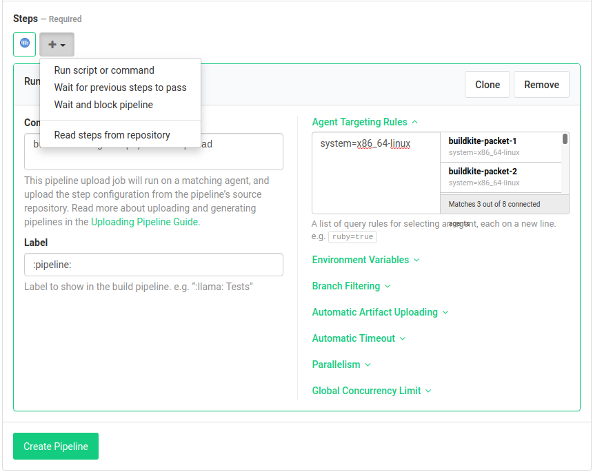

## How to start with `iohk-nix`

This document is for developers who want to add use `iohk-nix` to add
Hydra and Buildkite CI to their projects.

## Using the skeleton project

The easiest way to start is by copying the reference template
(skeleton). Follow the instructions in the [skeleton project](../skeleton)
to set up your code tree, then come back here for
information on how to set up the services.


## How to push to GitHub

1. Create a new repo in GitHub. It's generally safest to create a
   private repo first, then later get an organization admin to change
   it to public.

   However, note that Buildkite and Hydra won't work until the repos
   are made public.

2. In the GitHub repo _Collaborators & teams_ section, try to grant
   permissions to groups, not individual users. Make sure enough
   people have admin access.

   As an example, for Cardano projects, grant `Write` access to the
   [cardano-sl](https://github.com/orgs/input-output-hk/teams/cardano-sl)
   team, and `Admin` access to the
   [cardano-sl-admin](https://github.com/orgs/input-output-hk/teams/cardano-sl-admin)
   team.


## How to set up Buildkite

Use Buildkite for CI jobs which can't run in a pure sandboxed build
environment. Examples of these would be tests which need Internet
access, benchmarks, stack builds, or jobs which update a website.



1. Create a [New Pipeline](https://buildkite.com/organizations/input-output-hk/pipelines/new)
   in Buildkite for the project repo.

2. Add a single step from the template called "Read steps from repository".

   In this step, set the _Agent Targeting Rules_ to `system=x86_64-linux` (copy
   & paste that text into the text box).

3. Create the pipeline. Follow the instructions to set up the GitHub
   webhook for Buildkite.

4. Edit the pipeline settings. Under _Build Skipping_, enable the options:
    - Skip Intermediate Builds
    - Cancel Intermediate Builds

5. Grab the Build Badge link and put it in this file.

6. The pipeline definition is in [`.buildkite/pipeline.yml`](../skeleton/.buildkite/pipeline.yml).
   There is [documentation](https://buildkite.com/docs/pipelines) for this.

See [buildkite-scripts.md](./buildkite-scripts.md) for information on
how to set up CI scripts with all necessary dependencies available.

## How to set up scheduled builds in Buildkite

Scheduled builds are good for QA processes which should be run regularly, but
take too long to run on every git push.

1. Create a [New Pipeline](https://buildkite.com/organizations/input-output-hk/pipelines/new)
   in Buildkite for the project repo. Call it "My Project Nightly" or something like that.

2. Add a single step from the template called "Read steps from repository".

   - In this step, set the _Agent Targeting Rules_ to `system=x86_64-linux`

   - Modify the _Commands to run_ to be:

         buildkite-agent pipeline upload .buildkite/nightly.yml

3. Create the pipeline. Skip the webhook setup.

4. The pipeline definition is in [`.buildkite/nightly.yml`](../skeleton/.buildkite/nightly.yml).

## How to setup coveralls

Add the desired repository in
[`coveralls.io`](https://coveralls.io/github/input-output-hk/) (an account is
needed). After the repository is added, a token will be accessible in the
`coveralls.io` settings page of your project. This token needs to be associated
to an environment variable, e.g., `SKELETON_COVERALLS_REPO_TOKEN`, and the
environment variable needs to be set in Buildkite by
[@devops](https://app.slack.com/client/T0N639Z4N/CAP8NM7N0).

After the environment variable is set, pass the environment variable name to
[`Build.doBuild`](../utils/lib/Build.hs). File
[rebuild.hs](../skeleton/.buildkite/rebuild.hs) contains an example of how this
can done.

## How to set up Hydra

1. The list of Hydra jobsets are declared in the
   [iohk-ops](https://github.com/input-output-hk/iohk-ops) repo. Open
   a PR with a change according to the instructions at the top of
   [jobsets/default.nix](https://github.com/input-output-hk/iohk-ops/blob/master/jobsets/default.nix).

2. The jobset for this project is in [`release.nix`](../skeleton/release.nix). Add jobs to this
   file to build them with Hydra.

3. The purpose of `release.nix` is to select jobs defined in
   [`default.nix`](../skeleton/default.nix) and map them to all supported build
   platforms. After evaluating `release.nix`, Hydra will send the
   mapped jobs to its build farm.

4. There is a special job in `release.nix` called `required`. The
   build status of this job will be sent to GitHub. It is an
   "aggregate" -- a list of other jobs. The jobs that you add to this
   list will determine whether there is a green tick or red cross from
   Hydra in your GitHub.


## How to set up Bors

For general documenation about Bors, see
[`iohk-nix/docs/bors.md`](../docs/bors.md).

1. Most of the settings for Bors are in [`bors.toml`](../skeleton/bors.toml).

2. The settings for branches and permissions are found in the web
   interface at https://bors-ng.aws.iohkdev.io/repositories .

3. There are full instructions for setting up Bors for a new repo in
   [`iohk-ops/docs/bors.md`](https://github.com/input-output-hk/iohk-ops/blob/master/docs/bors.md).

If Bors is not required, delete `bors.toml`. You can always put it
back later.


## Appendix

### When not using the skeleton project

Use `iohk-nix` by "pinning" its git revision and source hash in a JSON
file. Then use iohk-nix to get nixpkgs. This is usually done with the
default arguments to `default.nix`. For example:

```nix
# default.nix
{ config ? {}
, system ? builtins.currentSystem
, sourcesOverride ? {}
, pkgs ? import ./nix { inherit config system sourcesOverride; }
}:

{
  # your builds go here
}
```

The `config` and `system` arguments above are needed when building for
other systems. They have default values, and should be passed through
to `iohk-nix`.

Now set up `./nix/default.nix`, which is pure boilerplate:

```nix
{ system ? builtins.currentSystem
, crossSystem ? null
, config ? {}
, sourcesOverride ? {}
}:
let
  # use default stable nixpkgs from iohk-nix instead of our own:
  sources = removeAttrs (import ./sources.nix) [ "nixpkgs" ] //
    sourcesOverride;

  # for inclusion in pkgs:
  nixpkgsOverlays = [
    (_: _: { commonLib = lib // iohkNix; })
  ];

  # Import IOHK common nix lib, using our sources as override:
  iohkNix = import sources.iohk-nix {
    inherit system crossSystem config nixpkgsOverlays;
    sourcesOverride = sources;
  };
  pkgs = iohkNix.pkgs;
  lib = pkgs.lib;
in
  pkgs
```

Setup niv (nix dependencies manager) with
```
nix-shell https://github.com/input-output-hk/iohk-nix/archive/master.tar.gz -A shell --run "niv init"
```

And add a minimal `shell.nix`:
```nix
with import ./nix {};
stdenv.mkDerivation {
  name = "shell";
  buildInputs = [ commonLib.niv ];
}
```
